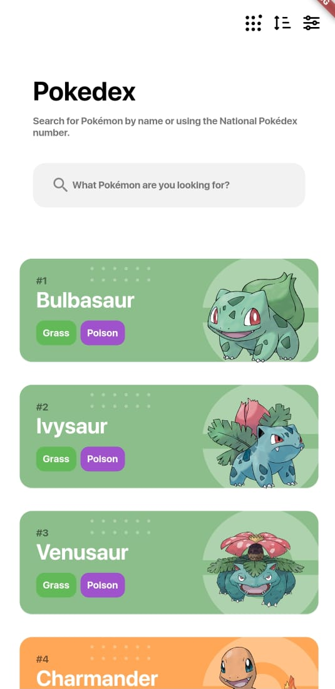
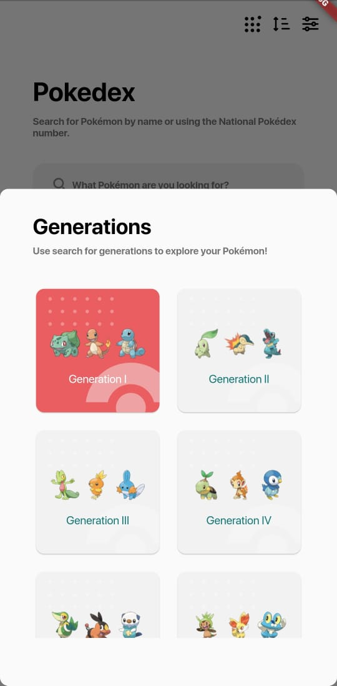
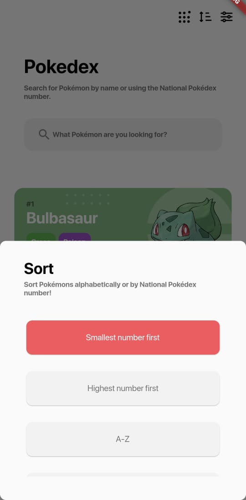
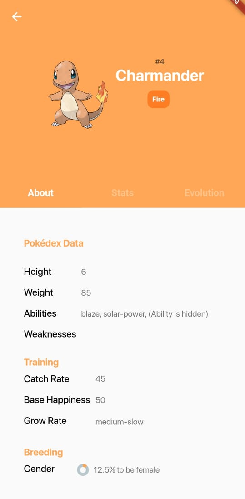
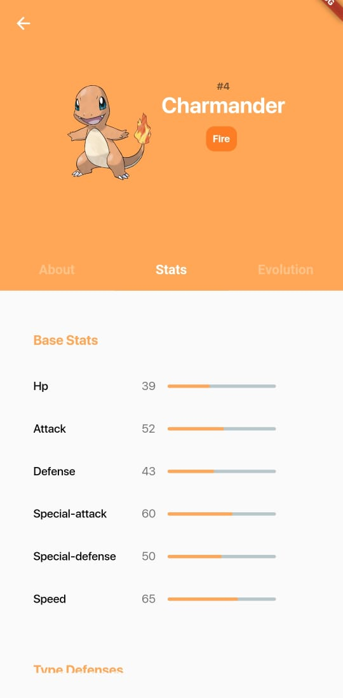

# Flutter Pokedex

Projeto seguindo passos de como criar uma pokedex em Flutter. Apenas para estudos

## Screenshots

## Funcionalidades

- [x]  Shimmer Effect
- [x]  States
- [x]  Cached Images
- [x]  Filter
- [x]  Search
- [ ]  Storage
- [x]  API
- [x]  Bloc
- [ ]  Tests

## Referência

 - [Pokedex APP](https://dribbble.com/shots/6545819-Pokedex-App)
 - [Pokedex API](https://pokeapi.co/)

## Melhorias

#### APP
- Pokemon - Evolution
- Pokemon - Moves
- Pokemon - Defenses

#### UI
 - DarkMode
 - Favorite Pokemon
 - Animations

## Licença

[MIT](https://choosealicense.com/licenses/mit/)

